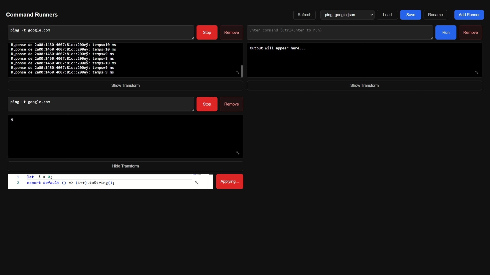

# CommandRunners

CommandRunners is a local-first full-stack app for running shell commands from a browser dashboard. It lets you open multiple command panels, watch live output, arrange panels in a draggable grid, and save dashboard layouts to disk for later reuse.

> [!WARNING]
> This application is intended for **local use only**.
> It can execute arbitrary shell commands with the same permissions as the account running the server.
> Do not expose it to untrusted users or public networks.



## Overview

The project is split into two parts:

- `client/`: a React + Bun frontend using GridStack and Monaco Editor
- `server/`: a TypeScript backend using Bun and Elysia that runs commands and stores saved dashboard states

## Features

- Run shell commands from a browser UI
- Stream combined stdout and stderr into each runner
- Open, remove, drag, and resize multiple runner panels
- Stop a running command from the UI
- Pause output updates while a command is still running, then resume
- Maximize a runner's output into a modal view
- Save, load, rename, refresh, and delete dashboard states
- Persist runner commands, transforms, and grid layout to JSON files
- Optionally transform output with a custom JavaScript function

## Quick Start

### Prerequisites

- [Bun](https://bun.sh/)

### 1. Start the backend

From `server/`:

```bash
bun install
bun --watch src/index.ts
```

### 2. Start the frontend

From `client/`:

```bash
bun install
bun --hot index.html
```

Then open the local URL printed by Bun.

## Bundled Build

The repository also includes `build.sh` for producing bundled artifacts with Bun:

```bash
./build.sh
```

The script runs two build steps:

- `bun build --compile --target=browser ./client/index.html --outdir=ts_server`
- `bun build --compile ./server/src/index.ts --outfile ./dist/command-runners`

This produces:

- `ts_server/`: the bundled frontend assets
- `dist/command-runners`: the compiled backend executable

If you are building on Windows, Bun will emit the backend binary as `dist/command-runners.exe`.

## Usage

1. Click `Add Runner`.
2. Enter a shell command.
3. Press `Run`, or use `Ctrl+Enter` in the command box.
4. Watch the output stream in real time.
5. Use `Pause` to freeze the displayed output while the process keeps running, then `Resume` to catch back up.
6. Use `Stop` to terminate the running process tree.
7. Use `Maximize` to focus on one runner's output and `Escape` to close the modal view.
8. Use `Show Transform` to open the Monaco editor and enter a default-exported JavaScript transform.
9. Use the header controls to `Load`, `Save`, `Rename`, `Delete`, and `Refresh` saved dashboard states.

Saved state files include:

- command text
- transform source
- transform enabled flag
- GridStack layout

Saved states do not restore active processes or previous output history.

Example transform module:

```js
export default function transform(output) {
	return output.toUpperCase();
}
```

## How It Works

### Client

The frontend in `client/` renders a grid of runner panels. Each runner stores:

- command text
- transform source
- whether the transform is enabled
- saved grid layout (`x`, `y`, `w`, `h`)

The UI also tracks the selected saved state file and whether the current dashboard has unsaved changes. The frontend currently expects the backend at `http://localhost:8000`.

### Server

The backend in `server/` exposes HTTP endpoints for command execution and state management:

- `GET /run?id=<id>&cmd=<command>`: start a command and stream output
- `GET /stop?id=<id>`: stop a running command by runner ID
- `POST /state?filename=<optional-name>`: save the current dashboard state
- `GET /states`: list saved state files
- `GET /state?filename=<name>`: load a saved state file
- `POST /state/rename`: rename a saved state file
- `DELETE /state?filename=<name>`: delete a saved state file

The server keeps active processes in memory and writes saved dashboard states to `server/states/`. Process stopping uses platform-specific handling so it works on both Windows and Linux.

## Project Structure

```text
CommandRunners/
  client/       # React + Bun frontend
  server/       # Bun + Elysia backend
    states/     # Saved dashboard state files
  doc/          # Project assets such as screenshots
```

## Limitations

- The backend accepts arbitrary shell commands.
- There is no authentication or authorization.
- CORS is fully open.
- Running processes are tracked in memory only.
- Saved state files store configuration and layout, not running-process state or output history.
- The frontend uses a hardcoded backend URL of `http://localhost:8000`.

## Security Notice

This project is a local development tool, not a production-ready remote execution service. Add authentication, access controls, and a safer execution model before considering any broader exposure.

## Development Notes

- The frontend uses Bun's HTML entrypoint workflow.
- Command output is streamed from the Bun + Elysia server using a `ReadableStream`.
- Custom transforms are loaded dynamically from JavaScript entered in the UI.
- Saved app state is stored as JSON files under `server/states/`.
